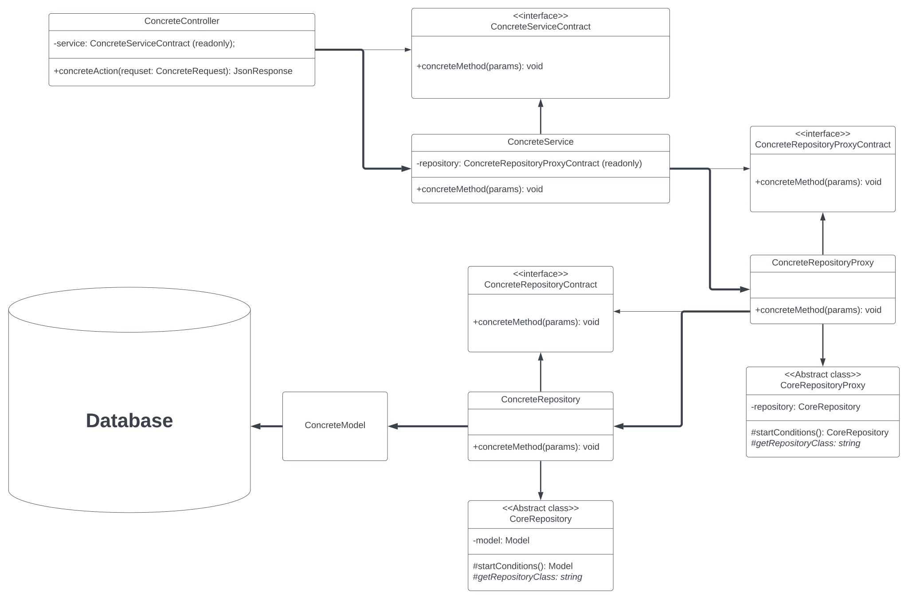

## About Project

This project is website shop that was created on the Laravel and Vue 3

## Used in the project

### Backend
- Laravel 10 - this is a backend framework, you can learn more about it at this [link](https://laravel.com/)
- Redis - this is a resident NoSQL database management system, you can learn more about it at this [link](https://redis.io/)
- L5-Swagger - you can learn more about it at this [link](https://github.com/DarkaOnLine/L5-Swagger)
- JWT-Auth - you can learn more about it at this [link](https://jwt-auth.readthedocs.io/en/develop/laravel-installation/)
### Frontend
- Vue 3 - this is a frontend framework, you can learn more about it at this [link](https://vuejs.org/)
- Vuex - this is a state management library, you can learn more about it at this [link](https://vuex.vuejs.org/)
- Vue Router - this is the official routing library for Vue.js, you can learn more about it at this [link](https://router.vuejs.org/)
- TypeScript - you can learn more about it at this [link](https://www.typescriptlang.org/)
- vue-slider-component - you can learn more about it at this [link](https://nightcatsama.github.io/vue-slider-component/#/)
- vue3-carousel - you can learn more about it at this [link](https://ismail9k.github.io/vue3-carousel/)
- axios - you can learn more about it at this [link](https://axios-http.com/ru/docs/intro)
- vue-i18n - you can learn more about it at this [link](https://vue-i18n.intlify.dev/)
- AdminLTE - you can learn more about it at this [link](https://github.com/jeroennoten/Laravel-AdminLTE)

## Project architecture
### Backend
- <b> MVC Pattern</b> - is a software design pattern commonly used for developing user interfaces that divides therelated program logic into three interconnected elements. This is done to separate internal representations of information from the ways information is presented to and accepted from the user. 
- <b> A Service Layer</b> - is a design pattern that encapsulates the business logic of your application and defines the boundaries and set of acceptable operations from the perspective of clients interacting with it. 
- <b> A Repository</b> - is a design pattern that encapsulates everything related to a data storage method. Goal: Separating business logic from the implementation details of the data access layer. 
- <b> A Proxy</b> - is a structural design pattern that provides an object that controls access to another object by intercepting all calls (performs the function of a container). 
- <b> A Strategy</b> -  is a behavioral design pattern for modifying algorithms, encapsulating each one, and making them interchangeable. This allows you to choose how to define the appropriate class. The Strategy pattern allows you to change the selected algorithm regardless of the client objects that use it. 
The diagram below shows an example relationships between the patterns and controllers for better understanding. 

### Frontend
- <b>axios</b>: This directory contains everything related to working with Axios, including API files. Here you can have separation of functions for interaction with the backend, as well as authorization using JWT tokens. 
- <b>components</b>: This directory contains reusable Vue components that can be used in different parts of your application. This may include buttons, forms, cards, and other interface elements. 
- <b>composables</b>: Composables can be found here, which provide logic and functionality for your components. This may include general functions for working with data, handling events, and other aspects. 
- <b>locales</b>: This directory stores the language files that are used to localize your application using the vue-i18n package. These files contain translations of text and messages into different languages. 
- <b>router</b>: This is where the Vue Router settings and routes are located. You describe which components should be rendered on different pages of your SPA application. 
- <b>store</b>: This directory is related to managing the state of your application using Vuex. It contains modules, mutations, actions and getters, as well as a main file that combines all the modules. 
- <b>types</b>: This can contain files with TypeScript type definitions that are used in all other parts of the application. This helps ensure stronger typing and reduce possible errors during development.
- <b>views</b>: This directory contains the main components that are displayed on different pages of application. These are the components that are associated with Vue Router and represent the main parts of interface.  

In the main directory:
- app.ts: This file serves as the entry point to the Vue application.
- App.vue: This file represents the main component of the SPA application.

## Launch of the project
First build the project using the command - `make build`

Then run the project using the command - `make start`

Then log into the docker container using the command - `make exec`

Now use the following commands `composer install` and `npm install` to install everything as required.

Next you need to perform migrations using the following command `php artisan migrate`.

If you want to autocomplete the database then enter the following command `php artisan migrate --seed`

If you need to stop the project, then use the command - `make stop`
